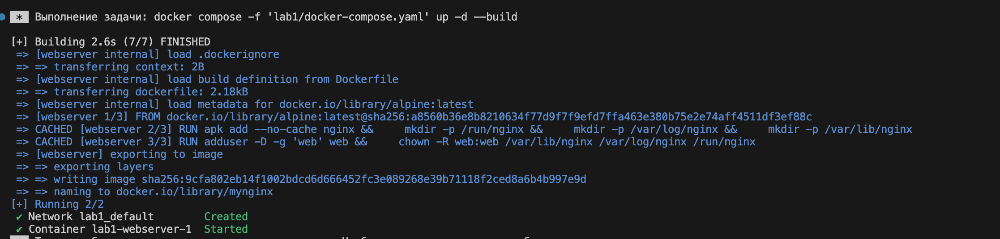
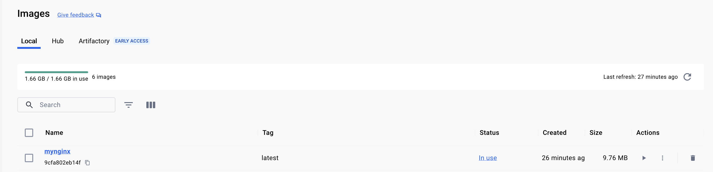
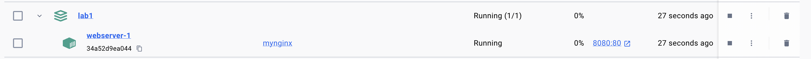
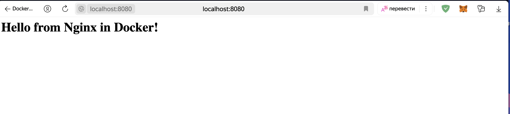
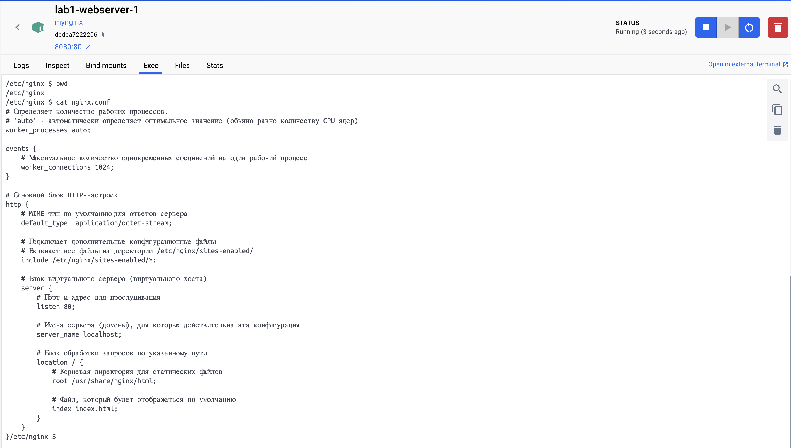
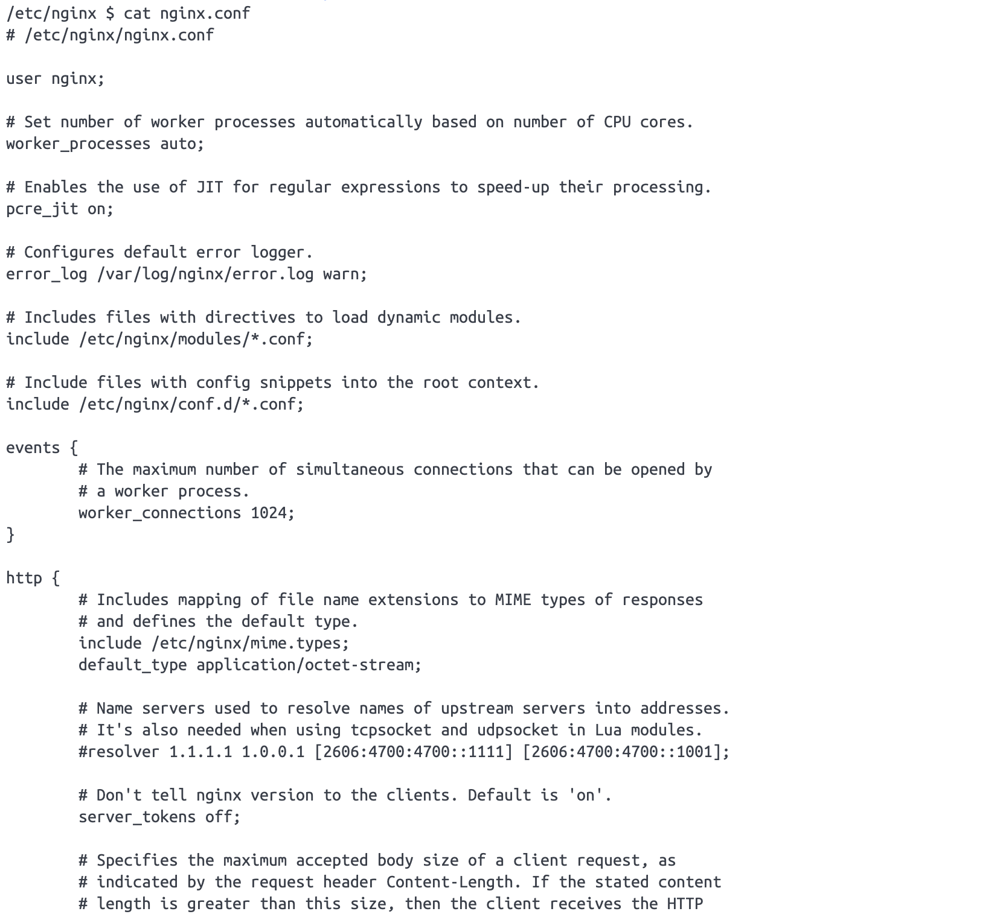

# Лабораторная работа №1
## Docker: Запуск nginx
### Цель: запустить в докере рабочий веб-сервер nginx


### Задание:
Первостепенный навык любого DevOps-специалиста – умение сделать так, чтобы приложение запускалось внутри docker-контейнера. Этот навык пригодится при любых условиях, как для локального тестирования кода, так и для работы с Kubernetes, поэтому мы должны хорошо владеть им в первую очередь.

Для начала, освоим самую базовую задачу – поднимем простенький web-сервер, не устанавливая пакетов на основную машину. Для этого нам понадобится запустить nginx внутри контейнера docker.

Безусловно, мы можем взять сразу готовый образ nginx, но так мы мало чему научимся, поэтому – попробуем воссаздать его самостоятельно.

### **Чекпойнты выполнения:**

1. Создать образ mynginx, который будет запускать nginx внутри контейнера
2. Получить ответ вашего nginx из контейнера по адресу http://localhost:8080
3. Использовать базовые легковесные образы – alpine
4. Добавить возможность конфигурирования nginx через внешний файл
5. Статические страницы (сайты) должны быть внешним томом volume
6. Контейнер должен запускаться от непривилегированного пользователя
7. Создать файл docker-compose для старта и сборки


## Ход работы:
Сначала был создан основной файл для конфигурации `nginx.conf`:

```conf
# Определяет количество рабочих процессов.
# 'auto' - автоматически определяет оптимальное значение
worker_processes auto;

events {
    # Максимальное количество одновременных соединений на один рабочий процесс
    worker_connections 1024;
}

http {
    # MIME-тип по умолчанию для ответов сервера
    default_type  application/octet-stream;

    # Подключает дополнительные конфигурационные файлы
    include /etc/nginx/sites-enabled/*;

    server {
        # Порт и адрес для прослушивания
        listen 80;
        
        # Имена сервера (домены), для которых действительна эта конфигурация
        server_name localhost;

        # Блок обработки запросов по указанному пути
        location / {
            # Корневая директория для статических файлов
            root /usr/share/nginx/html;
            
            # Файл, который будет отображаться по умолчанию
            index index.html;
        }
    }
}
```

Далее была создана папка в директории с Dockerfile с названием `static`, внутри которой был создан файл `index.html` для статики nginx сервера: 
```html
<h1>Hello from Nginx in Docker!</h1>
```

После того, как основные файлы для работы nginx были созданы, был реализован следующий Dockerfile:
```Dockerfile
# Использование базового образа Alpine
FROM alpine:latest

# Устанавка nginx и создание необходимых директорий
# --no-cache: не сохранять кеш пакетов
# Создание системных директорий, необходимых для работы nginx:
# - /run/nginx: PID-файлы и socket-файлы
# - /var/log/nginx: логи сервера
# - /var/lib/nginx: кеш и временные файлы
RUN apk add --no-cache nginx && \
    mkdir -p /run/nginx && \
    mkdir -p /var/log/nginx && \
    mkdir -p /var/lib/nginx

# Создание непривилегированного пользователя и группы для безопасности
# - -S: создание системного пользователя и группы (без домашней директории)
RUN addgroup -S webgroup && adduser -S web -G webgroup

# Изменение владельца системных директорий на созданного пользователя
RUN chown -R web:webgroup /var/lib/nginx /var/log/nginx /run/nginx

# Декларирование используемого порта
EXPOSE 80

# Переключение на непривилегированного пользователя перед запуском
USER web

# Запуск nginx в основном процесс контейнера
# -g "daemon off;": отключение демонизации nginx
ENTRYPOINT ["nginx"]
CMD ["-g", "daemon off;"]
```
который создает image nginx сервера.

После того, как был создан `Dockerfile` для создания nginx сервера, был написан `docker-compose.yaml` файл для пробрасывания порта, а также монтировании директории со статическими файлами и основой конфигурации веб сервера:
```yaml
version: '3.8'

services:
  webserver:  # Определение контейнера с именем "webserver"
    build: .  # Сборка образа из Dockerfile в текущей директории
    image: mynginx  # Имя образа "mynginx" после сборки
    ports:
      - "8080:80"  # Проброс порта 8080 хоста на 80-й порт контейнера
    volumes:
      - ./static:/usr/share/nginx/html:ro  # Монтирование статических файлов (только для чтения)
      - ./nginx.conf:/etc/nginx/nginx.conf:ro  # Монтирование конфига nginx (только для чтения)
```

# Проверка работы образа

Был запущен `docker-compose.yaml` файл с внешним файлом конфигурации и статическим файлом.

Появился соответствующий image в `images`.


Запустился контейнер.


По адресу http://localhost:8080 был доступен статический файл.


Внутри контейнера можно было надлюдать кастомную конфигурацию.


Затем контейнер был перезапущен без монтирования файла с кастомной конфигурацией, веб-сервер был запущен с дефолтной.
