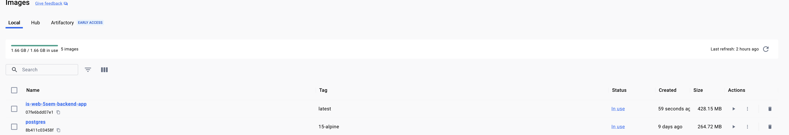
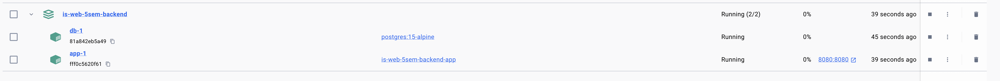
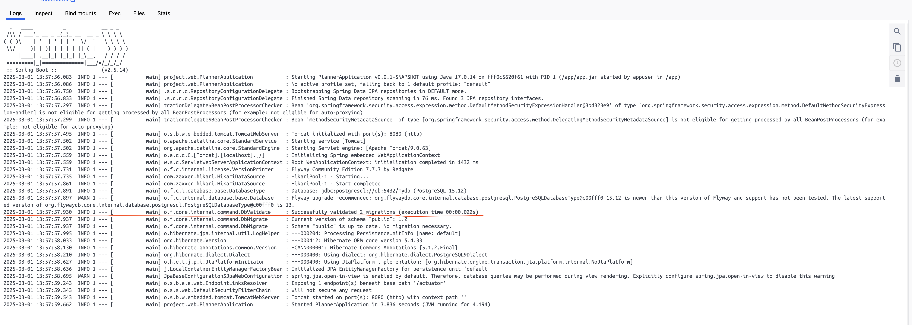
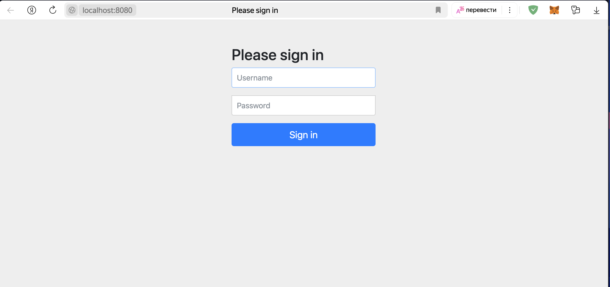

# Лабораторная работа №2
## Docker: докеризация приложения
### Цель лабораторной: собрать из исходного когда и запустить в докере рабочее приложение с базой данных (любое опенсорс - Java, python/django/flask, golang).


### Задание:
1. Образ должен быть легковесным
2. Использовать базовые легковестные образы - alpine
3. Вся конфигурация приложения должна быть через переменные окружения
4. Статика (зависимости) должна быть внешним томом `volume`
5. Создать файл `docker-compose` для старта и сборки
6. В `docker-compose` нужно использовать базу данных (postgresql,mysql,mongodb etc.)
7. При старте приложения должно быть учтено выполнение автоматических миграций
8. Контейнер должен запускаться от непривилегированного пользователя
9. После установки всех нужных утилит, должен очищаться кеш


# Лабораторная работа №3
## Docker: Мультистейджинг, сборка и запуск
### Цель лабораторной: освоить подход создания легковесного образа путем сборки приложения на одном образе, и запуска на другом. Рекомендуется использовать любое опенсорс приложение требующее сборку приложение (Java,C/C++,Golang, Node).

### Задание:
1. Образ должен быть легковесным
2. Использовать базовые легковестные образы - alpine
3. Сборка приложения должна происходить в первом образе
4. Запуск приложения выполняется во втором образе, через копирование артефакта
5. Вся конфигурация выполняется через переменные окружения
6. Сборка и запуск приложения должно быть оформлено в	одном Dockerfile
7. При сборке приложения, каждый этап сборки должен выполняться только при изменении зависимых файлов
8. Создать файл docker-compose для старта и сборки
9. Контейнер должен запускаться от непривилегированного пользователя
10. После установки всех нужных утилит,	должен очищаться кеш

## Ход работы:
Так как задания очень схожи для 2-ой и 3-ей лабораторной работы - было решено выполнить все пункты из них в одном решении.

В качестве тест проекта был выбран `https://github.com/russianZAK/is-WEB-5sem-backend` - Java, Spring приложение, с базой данной и миграциями Flyway.

Был создан файл `.env` для переменных окружения `docker-compose.yaml` для бд.

```env
DB_USER=admin
DB_PASSWORD=secret
```

Далее были написаны следующие `Dockerfile`:

```Dockerfile
# Этап сборки: используется базовый образ Maven с Temurin JDK
FROM maven:3.9.9-eclipse-temurin-23-alpine AS build

# Устанавка рабочей директории
WORKDIR /app

# Копирование файла pom.xml и загрузка зависимостей
COPY pom.xml .

# --go-offline: кэширование зависимостей для автономной сборки
# -B: режим без интерактивного вывода (batch mode)
RUN mvn dependency:go-offline -B

# Копирование исходного кода и сборка проекта
COPY src src
RUN mvn package

# Финальный образ: используование легковесного Amazon Corretto 17
FROM amazoncorretto:17-alpine

# Использование переменных окружения для конфигурации
ENV APP_HOME="/app" \
    JAVA_OPTS=""

# Создание системного пользователя для безопасности:
# - -S: создание пользователя без домашней директории
# - -G appgroup: добавление пользователя в группу
RUN addgroup -S appgroup && adduser -S appuser -G appgroup

# Устанавка рабочей директории
WORKDIR $APP_HOME

# Копирование собранного JAR из этапа сборки
COPY --from=build /app/target/*.jar app.jar

# Изменение владельца файла на непривилегированного пользователя
RUN chown -R appuser:appgroup $APP_HOME

# Переключение на непривилегированного пользователя перед запуском
USER appuser

# Декларирование используемого порта
EXPOSE 8080

# Запуск приложения
CMD ["sh", "-c", "java $JAVA_OPTS -jar app.jar"]
```


и `docker-compose.yaml`:
```yaml
version: '3.8'

services:
  app:
    build: .  # Указывает, что образ собирается из Dockerfile в текущей директории
    environment:
      SPRING_DATASOURCE_URL: jdbc:postgresql://db:5432/mydb  # URL подключения к БД PostgreSQL
      SPRING_DATASOURCE_USERNAME: ${DB_USER}  # Имя пользователя БД (берётся из переменной окружения)
      SPRING_DATASOURCE_PASSWORD: ${DB_PASSWORD}  # Пароль пользователя БД (берётся из переменной окружения)
      JAVA_OPTS: "-Xmx512m"  # Устанавливает максимальный размер кучи JVM (512 MB)
    ports:
      - "8080:8080"  # Пробрасывает порт 8080 из контейнера в хост-систему
    depends_on:
      db:
        condition: service_healthy  # Гарантирует, что контейнер с БД будет запущен и готов перед `app`
    volumes:
      - maven-repo:/root/.m2  # Использует общий том для кеширования зависимостей Maven

  db:
    image: postgres:15-alpine  # Использует легковесный образ PostgreSQL 15 на базе Alpine Linux
    environment:
      POSTGRES_USER: ${DB_USER}  # Имя пользователя БД (из переменной окружения)
      POSTGRES_PASSWORD: ${DB_PASSWORD}  # Пароль БД (из переменной окружения)
      POSTGRES_DB: mydb  # Имя создаваемой базы данных при запуске контейнера
    volumes:
      - postgres-data:/var/lib/postgresql/data  # Подключает том для хранения данных БД
    healthcheck:
      test: ["CMD-SHELL", "pg_isready -U ${DB_USER} -d mydb"]  # Проверяет доступность БД
      interval: 5s  # Запускает проверку каждые 5 секунд
      timeout: 5s  # Ожидает ответ не дольше 5 секунд
      retries: 5  # Повторяет проверку до 5 раз перед признанием контейнера недоступным

volumes:
  maven-repo:  # Определяет том для кеширования зависимостей Maven
  postgres-data:  # Определяет том для хранения данных PostgreSQL

```
которые покрывают следущие пункты:

1. Использовать базовые легковестные образы - alpine
2. Сборка приложения должна происходить в первом образе
3. Статика (зависимости) должна быть внешним томом `volume`
4. Запуск приложения выполняется во втором образе, через копирование артефакта
5. Вся конфигурация выполняется через переменные окружения
6. Сборка и запуск приложения должно быть оформлено в	одном Dockerfile
7. При старте приложения должно быть учтено выполнение автоматических миграций - выполняются автоматически при старте приложения через Flyway.
8. При сборке приложения, каждый этап сборки должен выполняться только при изменении зависимых файлов
9. Создать файл docker-compose для старта и сборки
10. В `docker-compose` нужно использовать базу данных (postgresql,mysql,mongodb etc.)
11. Контейнер должен запускаться от непривилегированного пользователя
12. После установки всех нужных утилит,	должен очищаться кеш


# Проверка работы образа
Был запущен `docker-compose.yaml`.
Появились соответствующие images в `images`.


Запустились контейнеры с приложением, а также базой данных.


Выполнились автоматические миграции. (Валидация)


Приложение доступно по адресу http://localhost:8080.
