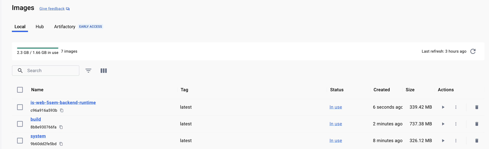
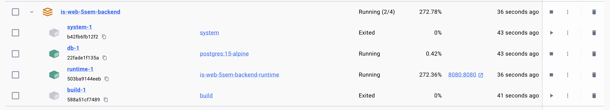
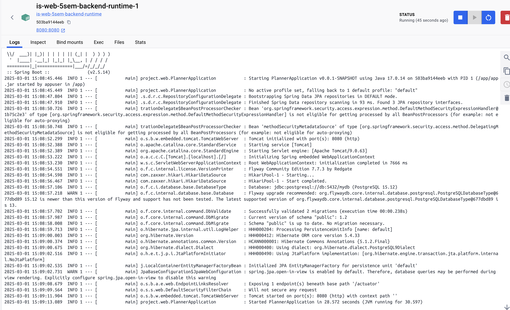
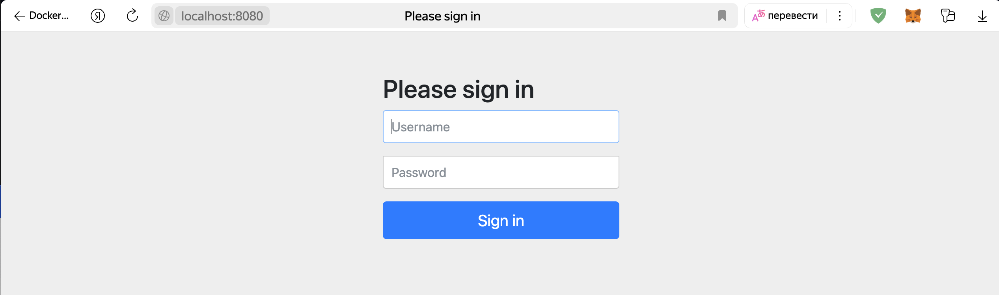

# Лабораторная работа №4
## Docker: Мультистейджинг, различные уровни зависимостей
### Цель лабораторной: освоить методы создания образов с разными уровнями зависимостей

### Задание:
1. Создать Dockerfile, который будет называться system. В него будут установлены все зависимости для сборки проекта. Как пример голая node нужной версии.
2. Создать Dockerfile Для сборки и назвать его build. В нем будет собираться проект, он должен использовать имедж system. В build нельзя устанавливать никакие дополнительные зависимости, т.е. apk add, apt install и пр. запрещены. В нём можно только скачивать зависимости и делать сборку проекта.
3. Создать Dockerfile, который будет запускать код , который собрался в build. В нем должен быть только инструмент для запуска вашего проекта, как пример для node проекта - npm run start и пр. Если у вас python проект - объединять 2 и 3 шаги - можно. Если вы билдите проект на GO - тогда должен быть только бинарник для запуска.
4. Вся конфигурация выполняется через переменные окружения
5. Использовать базовые легковестные образы - alpine
6. Контейнер должен	запускаться от непривилегированного пользователя
7. После установки всех нужных утилит,	должен очищаться кеш


## Ход работы:
В качестве тест проекта был выбран `https://github.com/russianZAK/is-WEB-5sem-backend` - Java, Spring приложение, с базой данной и миграциями Flyway.

Был создан файл `.env` для переменных окружения `docker-compose.yaml` для бд.
```env
DB_USER=admin
DB_PASSWORD=secret
```

Далее были написаны следующие `system.Dockerfile`:

```Dockerfile
# Использование базового образа Alpine
FROM alpine:latest

# Устанавка maven для сборки, затем очищается кеш
RUN apk add --no-cache maven
```

`build.Dockerfile`:
```Dockerfile
# Использование system.Dockerfile как базовый образ для этапа сборки
FROM system AS build

# Устанавка рабочей директории
WORKDIR /app

# Копирование файла pom.xml и загрузка зависимостей
COPY pom.xml .

# --go-offline: кэширование зависимостей для автономной сборки
# -B: режим без интерактивного вывода (batch mode)
RUN mvn dependency:go-offline -B

# Копирование исходного кода и сборка проекта
COPY src src
RUN mvn package

# Создание директории для сохранения финального JAR файла и копирование его туда
RUN mkdir /output && cp target/*.jar /output/
```

`runtime.Dockerfile`:
```Dockerfile
# Использование базового образа Alpine для создания финального образа для выполнения приложения
FROM alpine:latest AS runtime

# Установка JRE для запуска Java приложений
RUN apk add --no-cache openjdk17-jre

# Создание системного пользователя для безопасности:
# - -S: создание пользователя без домашней директории
# - -G appgroup: добавление пользователя в группу
RUN addgroup -S appgroup && adduser -S appuser -G appgroup

# Использование переменных окружения для конфигурации
ENV APP_HOME="/app" \
    JAVA_OPTS=""

# Устанавка рабочей директории
WORKDIR $APP_HOME

# Копирование собранного JAR из этапа сборки
COPY --from=build /output/*.jar app.jar

# Изменение владельца файла на непривилегированного пользователя
RUN chown -R appuser:appgroup $APP_HOME

# Переключение на непривилегированного пользователя перед запуском
USER appuser

# Декларирование используемого порта
EXPOSE 8080

# Запуск приложения
CMD ["sh", "-c", "java $JAVA_OPTS -jar app.jar"]
```

и `docker-compose.yaml`:
```yaml
version: '3.8'

services:
  # Система, использующая system.Dockerfile
  system:
    build:
      context: .
      dockerfile: system.Dockerfile
    image: system

  # Сервис для сборки
  build:
    build:
      context: .
      dockerfile: build.Dockerfile
    depends_on:
      - 'system'
    volumes:
      - maven-repo:/root/.m2  # Использует общий том для кеширования зависимостей Maven
    image: build
  db:
    image: postgres:15-alpine  # Использует легковесный образ PostgreSQL 15 на базе Alpine Linux
    environment:
      POSTGRES_USER: ${DB_USER}  # Имя пользователя БД (из переменной окружения)
      POSTGRES_PASSWORD: ${DB_PASSWORD}  # Пароль БД (из переменной окружения)
      POSTGRES_DB: mydb  # Имя создаваемой базы данных при запуске контейнера
    volumes:
      - postgres-data:/var/lib/postgresql/data  # Подключает том для хранения данных БД
    healthcheck:
      test: ["CMD-SHELL", "pg_isready -U ${DB_USER} -d mydb"]  # Проверяет доступность БД
      interval: 5s  # Запускает проверку каждые 5 секунд
      timeout: 5s  # Ожидает ответ не дольше 5 секунд
      retries: 5  # Повторяет проверку до 5 раз перед признанием контейнера недоступным

  runtime:
    build:
      context: .
      dockerfile: runtime.Dockerfile
    environment:
      SPRING_DATASOURCE_URL: jdbc:postgresql://db:5432/mydb  # URL подключения к БД PostgreSQL
      SPRING_DATASOURCE_USERNAME: ${DB_USER}  # Имя пользователя БД (берётся из переменной окружения)
      SPRING_DATASOURCE_PASSWORD: ${DB_PASSWORD}  # Пароль пользователя БД (берётся из переменной окружения)
      JAVA_OPTS: "-Xmx512m"  # Устанавливает максимальный размер кучи JVM (512 MB)
    ports:
      - "8080:8080"
    depends_on:
      db:
        condition: service_healthy
      build:
        condition: service_started

volumes:
  maven-repo:
  postgres-data:
```


# Проверка работы образа
Был запущен `docker-compose.yaml`.
Появились соответствующие images в `images`.


Запустились контейнеры с приложением, а также базой данных.




Приложение доступно по адресу http://localhost:8080.
